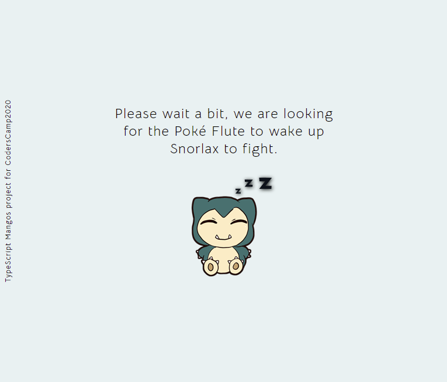
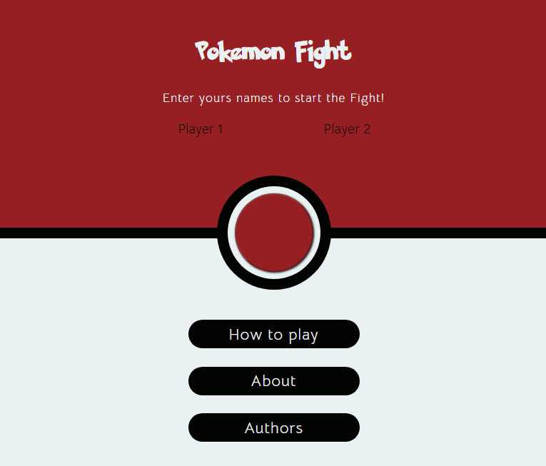
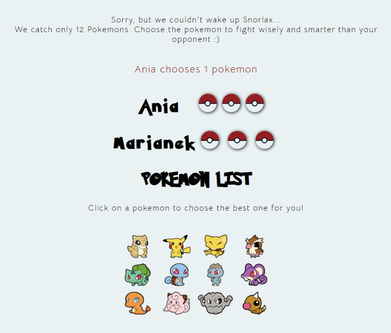
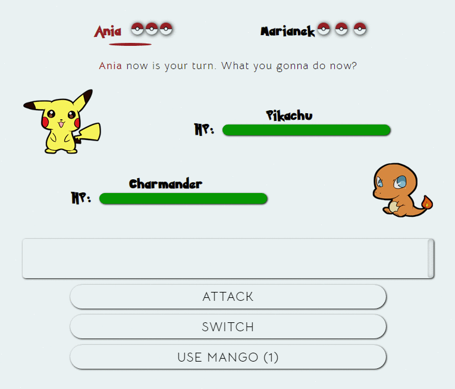
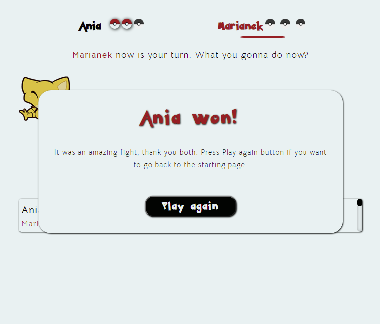

# CodersCamp 2020 - Projekt TypeScript
## Pokemon Fight
Projekt prezentuje praktyczną znajomość różnych zagadnień związanych z TypeScript.

Aplikacja została stworzona w oparciu o JavaScript z TypeScriptem. 

# [DEMO](https://lukaszdutka.github.io/CodersCamp2020.Project.TypeScript.pokemonfight/)

**Pokemon Figth** wzorowany był na popularnej grze Pokemon. Design projekty: [Figma](https://www.figma.com/file/q0IcE7FOL1GEi7sXvhE5WE/Pokemon-Fight?node-id=0%3A1)
Projekt jest ukończony.

### Zespół projektowy
Mentor:
[Łukasz Dutka](https://github.com/lukaszdutka)

Uczestnicy:
* [Aleksandra Cypko](https://github.com/AleksandraCyp) (Product Owner)
* [Małgorzata Dziewit](https://github.com/memeraki) (UX Designer)
* [Daria Dziubałtowska](https://github.com/daria305) 
* [Agata Ludwiczyńska](https://github.com/AgataLudwiczynska) (Develepment Manager)
* [Mariusz Smarż](https://github.com/mariusz-sm) (Tech Lead)

### Wykorzystane technologie:
- JavaScript z TypeScript
- HTML
- CSS - SASS

### Narzędzia z jakimi pracowaliśmy:
- Visual Studio Code
- Git
- GitHub Desktop
- Figma
- Trello

#### Wymagania funkcjonalne

1. Ekran ładowania - śpiący Snorlax
2. Ekran startowy - pola do wpisania imion graczy, którzy będą grają obok siebie na komputerze
3. Ektan wyboru pokemonów - gracze wybierają po 3 pokemony z puli 12 pokemonów.
4. Ekran walki - jedno menu dla obu graczy, zmieniają się imiona. Gracz pierwszy zaczyna. 
    - w jednym czasie walczą tylko dwa pokemony (domyślnym, pierwszym pokemonem jest ten wybrany przez gracza jako pierwszy)
    - menu wyboru akcji: 3 buttony
        > atak (wyświetla dwie opcje wyboru ataku oraz jedną powrotu do menu wyboru akcji)
        > switch (wyświetla dostępne opcje zmiany pokemona na inny oraz jedną powtoru do menu wyboru akcji)
        > heal - "eat mango" (bezpośrednia akcja odnawiająca życie aktywnego pokemona do maximum HP - gracz może skorzystać z tej akcj tylko jeden raz w ciągu gry)
5. UI - czytelny, interaktywny i responsywny 
6. Pokemon posiada:
    - Punkty Życia/HP
    - Atak i Obrone 
    - Typy (np. Bulbasaur: grass, poison) 
    - Moves / Ruchy (ataki mają swoje typy np. tackle: normal, fire blast: fire)
7. Algorytm obliczania obrażęń uwzględniający typ pokemona przeciwnika oraz typ ataku aktywnego pokemona
    - obrażenia są normalne, mało skuteczne lub bardzo skuteczne - w zależności od typu pokemona i typu ataku
8. Okno z informacjami o przebiegu gry
9. Gra kończy się, kiedy wszystkie pokemony jednego z graczy będą niezdolne do walki (0 hp)
10. Komunikat końcowy - kto wygrał, powrót do ekranu startowego
11. Animacje:
    - ataki - domyślna animacja wspólna dla wszystkich
    - zmiana pokemona
    - zaznaczanie aktywnego gracza
12. Spójne kolory i czcionki oraz style dla przycisków i interfejsu.
13. Wybrane pokemony do implemantacji (id, nazwa, typy):
    - 1 Bulbasaur - Grass/Poison
    - 4 Charmander - Fire
    - 7 Squirtle - Water
    - 13 Weedle - Bug
    - 16 Pidgey - Normal/Flying
    - 19 Rattata - Normal
    - 25 Pikachu - Electric
    - 27 Sandshrew - Ground
    - 35 Clefairy - Fairy
    - 63 Abra - Psychic
    - 66 Machop - Fighting
    - 73 Geodude - Rock/Ground